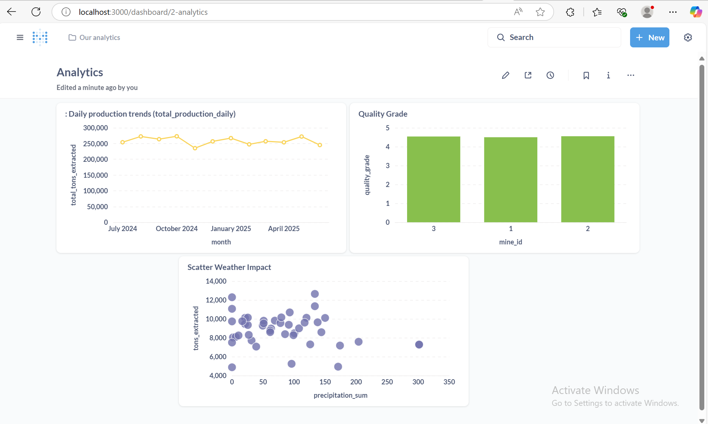

# ETL Pipeline for Mining Equipment, Weather, and Production Logs

## Overview

This data warehouse integrates data from three main sources to support mining production and weather condition analysis and reporting:

1. **Weather Data** - Collected from an external API and stored in the `raw.weather` table.
2. **Equipment Sensor Data** - Imported from CSV files and stored in the `raw.equipment_sensors` table.
3. **Production Data** - Daily mining production data originating from a MySQL database, loaded into `raw.production_logs` and `raw.mines` tables (mine reference data).

Data from these sources are processed and aggregated into the transform and data mart layers to support aggregated analysis and reporting.

---

## Layers Description

### 1. Raw Layer

This layer contains raw data extracted directly from the original data sources without transformation or aggregation.

- `raw.weather`: Stores daily weather data including date, temperature, and precipitation.
- `raw.equipment_sensors`: Stores heavy equipment sensor data including status, fuel consumption, and maintenance alerts.
- `raw.mines`: Contains master data of mining locations and identities.
- `production_logs`: Daily production data with details on shift, tons extracted, and quality grade.

---

### 2. Transform Layer

This layer processes raw data to produce cleaned, aggregated, and integrated datasets.

- `transform.equipment_utilization_daily`: Daily summary of equipment utilization based on sensor data.
- `transform.production_summary_daily`: Daily summary of production combining production logs with mine reference data, including total tons and average quality.

---

### 3. Data Mart Layer

This layer contains tables designed for business analysis and reporting purposes using aggregated and ready-to-query data.

- `data_mart.production_weather_summary_daily`: Daily aggregated table integrating production data with weather data and fuel efficiency for analyzing weather impact on mining production.

---

## Source Data Integration

| Source             | Type            | Raw Table(s)                       | Import/Extraction Method         |
|--------------------|-----------------|----------------------------------|---------------------------------|
| Weather API        | External API    | `raw.weather`                    | Data fetched through API calls  |
| Equipment Sensors  | CSV File        | `raw.equipment_sensors`          | Loaded from CSV into the table  |
| MySQL Database     | Relational DB   | `raw.production_logs`, `raw.mines`| Replicated or ETL loaded into DorisDB |

---

## Summary

This data warehouse adopts a layered architecture to ensure well-managed data:

- The **Raw layer** stores the original source data without modifications.
- The **Transform layer** cleanses, calculates, and aggregates data as required for analysis.
- The **Data Mart layer** prepares aggregated, analysis-ready data for dashboards and reports.

---

Would you like me to provide example SQL queries to move data between layers or generate additional documentation such as a data warehouse architecture diagram?


## IP list
| Service   | Container Port | Host Port | Description                         |
|-----------|----------------|-----------|-----------------------------------|
| fe        | 8030           | 8030      | Doris Frontend HTTP API            |
| fe        | 9030           | 9030      | Doris Frontend HTTP API (alt port)|
| fe        | 9010           | 9010      | Doris Frontend internal communication |
| be        | 8040           | 8040      | Doris Backend HTTP API             |
| be        | 9050           | 9050      | Doris Backend port                 |
| mysql     | 3306           | 3306      | MySQL default port                 |
| metabase  | 3000           | 3000      | Metabase Web UI port               |


## ENV
```
MYSQL_HOST=172.20.0.12
MYSQL_USER=etluser
MYSQL_PASS=etlpass
MYSQL_DB=coal_mining
MYSQL_PORT=3306

DORIS_HOST=172.20.0.10
DORIS_USER=root
DORIS_PASS=
DORIS_DB=raw
DORIS_PORT=9030
```

## Requirements
```
mysql-connector-python
pandas
requests
dotenv
```

## Runing
```
docker-compose up --build
```


## Dashboard Query

1. Daily production trends (total_production_daily)
```sql
SELECT
  DATE_FORMAT(`date`, '%Y-%m') AS month,
  SUM(tons_extracted) AS total_tons_extracted
FROM
  production_weather_summary_daily
GROUP BY
  month
ORDER BY
  month;
```

2. Quality Grade
```sql
SELECT
mine_id,
sum(quality_grade*tons_extracted)/sum(tons_extracted) quality_grade
from transform.production_summary_daily
group by 1
[[where {{date_start}} > date and date < {{date_end}}]]
```

3. Scatter Weather Impact
```sql
SELECT
precipitation_sum,
tons_extracted
from production_weather_summary_daily
[[where {{date_start}} < date and date < {{date_end}}]]
```

